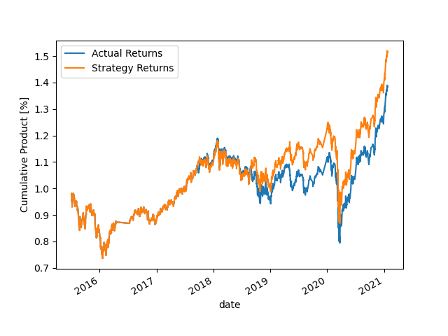
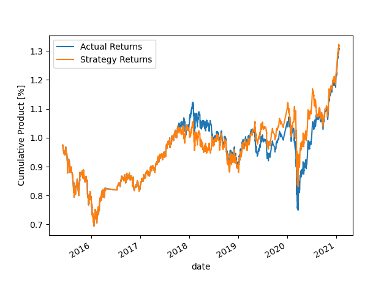
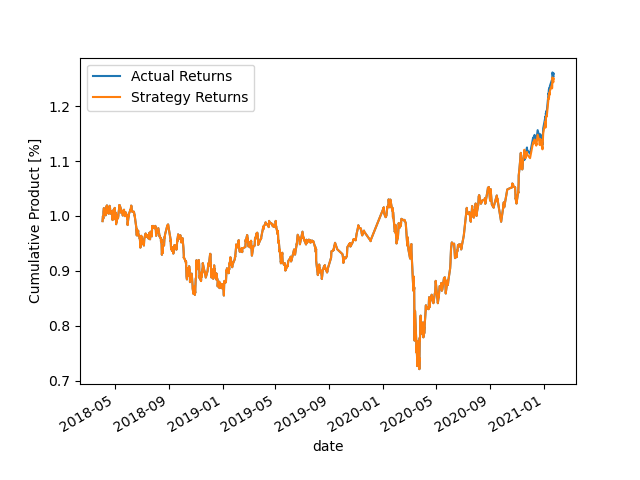
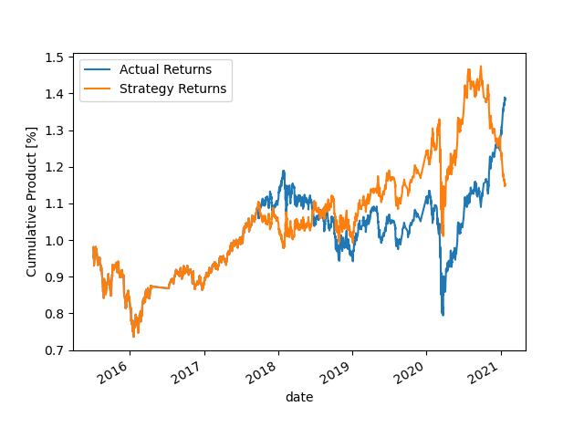
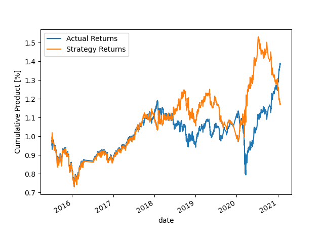
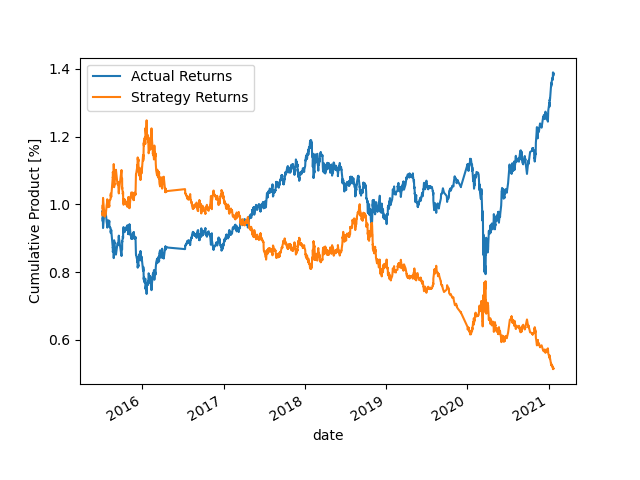
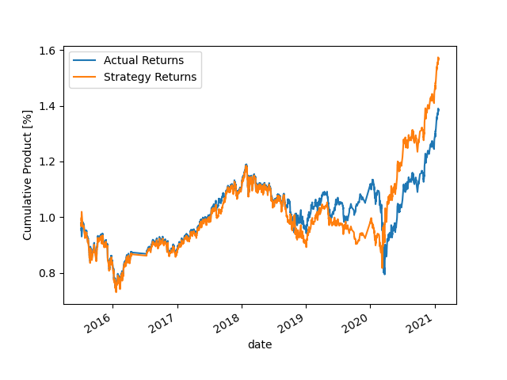
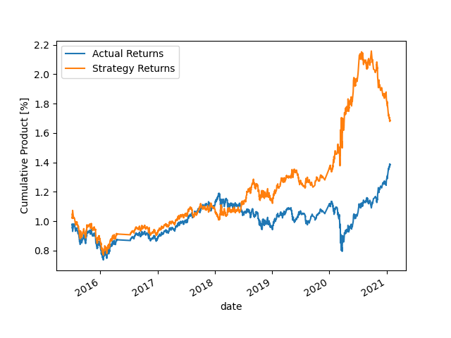

# Machine Learning Trading Bot
## **Overview of the Objective**
The purpose of this analysis is to assess the performance of various prediction models and data pre-processing techniques in order to identify an automated trading strategy that is superior in predicting the hightest cumulative product from half-hourly investments in the emerging markets exchange-traded fund (ETF) by Morgan Stanley Capital International (MSCI).
****

## **Comparing different pre-processing techniques with SVM classifier**

### Step 1: The baseline model is setup with training data configured as:
* SMA Short window = 4, SMA Long window = 100

Results:

|  | precision | recall  | f1-score | support |
| -   | -  | -   | -  | -       | 
| 0 | 0.43 | 0.04 | 0.07 | 1804 | 
| 1 | 0.56 | 0.96 | 0.71 | 2288 | 
| accuracy | |  | 0.55 | 4092 |  |
| macro avg | 0.49 | 0.50 | 0.39 | 4092 | 
| weighted avg | 0.50 | 0.55 | 0.43 | 4092 | 
|  |  |  |  |  | 

 
 
 

### Step 2: The baseline model's features have been re-configured as:
* SMA Short window = 4, SMA Long window = 50

Results:

|  | precision | recall  | f1-score | support |
| -   | -  | -   | -  | -       |
| 0 | 0.42 | 0.13 | 0.19 | 1826 | 
| 1 | 0.56 | 0.86 | 0.68 | 2321 | 
| accuracy | |  | 0.54 | 4147 |
| macro avg | 0.49 | 0.49 | 0.43 | 4147 |
| weighted avg | 0.50 | 0.54 | 0.46 | 4147 |
|  |  |  |  |  | 

 
 
 

### Step 3: The baseline model's features have been sliced to a different 3 months period as follows:
* Short window = 4, Long window = 100
* Training Data Begining: 2018
* Training Data End: Training Data Beginning + Offset of 3months

Results:

|  | precision | recall  | f1-score | support |
| -   | -  | -   | -  | -       |
| 0 | 0.38 | 0.00 | 0.01 | 773 | 
| 1 | 0.55 | 0.99 | 0.71 | 948 | 
| accuracy | |  | 0.55 | 1721 |
| macro avg | 0.46 | 0.50 | 0.36 | 1721 |
| weighted avg | 0.47 | 0.55 | 0.39 | 1721 |
|  |  |  |  |  | 

## **Outcome**

#### **What impact resulted from increasing or decreasing either or both of the SMA windows?**

I established that tighter windows returned less profits as it does not reflect the general long-term bullishness of the market.

#### **What impact resulted from increasing or decreasing the training window?**
This will depend on the time period chosen, however I did not want to choose the best case scenario of 2022 when the market was rallying just to see if there would be any improvement when looking only at 2018 perdiod.

## **Evaluation Report**
-----

For the next section of the analyis, I will use the baseline model configuration and benchmark the performance obtained from 5 different model classifiers to identify which will yield the highest returns, the results are provided below:

|  | | 
| -   | -  | 
| **Logistic Regression** | **Random Forest** | 
|  | |
|  **Decsion Trees**| **AdaBoost** |  
|   |  |
| **KNN** |  | 
|  | | 
|  |  |

## Analysis
The plots have been presented in above for the returns achieved based on the various prediciton models used. The worse performance was notably perceived from the Decision Tree method, which may reflect on the fact that decision trees can be complex to set up and are also not the favourable choice for predicting simple data with a small amount of features. Logistic Regression and Random Forest gave somewhat similar response, however failed to predict returns in the later parts of the trend, which may indicate further losses for the future. AdaBoost provided low-risk and stable profits. That was also the closest prediction model to the SVM method. And the most rewarding prediction model for my specific data has been achieved by the KNN K-Nearest Neighbors method.

